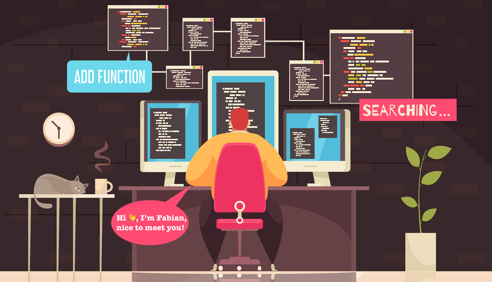

# 👋 Welcome to My GitHub!

Hi there! I’m **Fabian**, a passionate developer who loves ☕ coffee, 🐈 cats, and crafting beautiful code. Here’s a little about me:

---

## 🌟 About Me

- 📫 **How to reach me**: [info@fabianmail.com](mailto:info@fabianmail.com)
- 📖 **What I love**: Coffee, cats, and creating amazing things with code.
- 💻 **Current Focus**: Exploring new technologies and improving my craft every day.

---

## 🛠️ Tools & Technologies

Here are some of the tools and technologies I work with:

- **Editor**: Neovim (because who doesn’t love a good Neovim?).

---

## 🌱 Fun Facts

- ☕ I believe coffee is the fuel for creativity.
- 🐱 My cats are my coding companions—they love to sit on my keyboarsdjkjfd!

---

## 📫 Let’s Connect!

Feel free to reach out or explore my repositories. I’d love to hear from you!

---

> “Code is like coffee—it’s better when shared.” ☕
